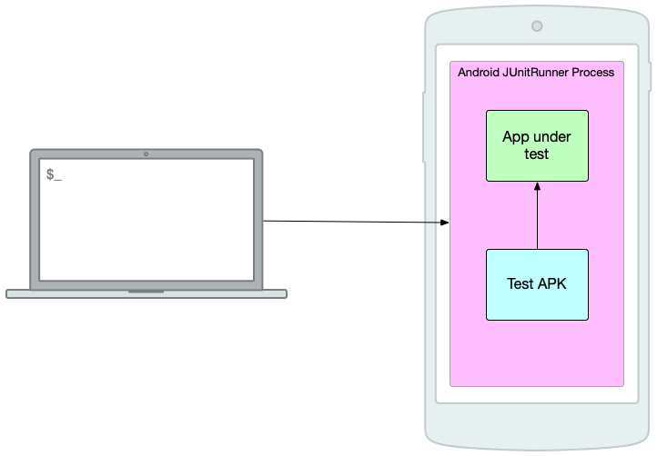

---

theme: "white"

---

## Taming Android on-device testing

---

## In this talk

1. Why test on devices?
2. Challenges with on-device testing
3. Some things that can help:
   1. Android Test Orchestrator
   2. Firebase test lab
   3. Fladle
   4. Scrimp
   5. Test failure tracking

---

## Why test on devices?

We can't isolate everything from the OS.

* E2E tests, integration tests, UI tests
* OS version differences
* Device/manufacturer differences

---

## Challenges

* Slow
* Flaky

---

# Android Test Orchestrator

---

## Without Android Test Orchestrator

---

## Android Test Orchestrator

---

## Android Test Orchestrator

---

## Android Test Orchestrator

---

## Android Test Orchestrator

---

# Firebase Test Lab

---

## Firebase Test Lab

---

## Firebase Test Lab

---

## Firebase Test Lab

---

## Firebase Test Lab

---

# Fladle

---

## Fladle

---

## Fladle

---

## Fladle

---

## Fladle

---

## Fladle

---

## Fladle

---

## Fladle

---

## Fladle

---

## Fladle

---

## Fladle

---

# Scrimp

---

## Scrimp

---

## Scrimp

---

## Scrimp

---

## Scrimp

---

# Test failure tracking

---

## Test failure tracking

---

## Test failure tracking

---

## Test failure tracking

---

## Test failure tracking

