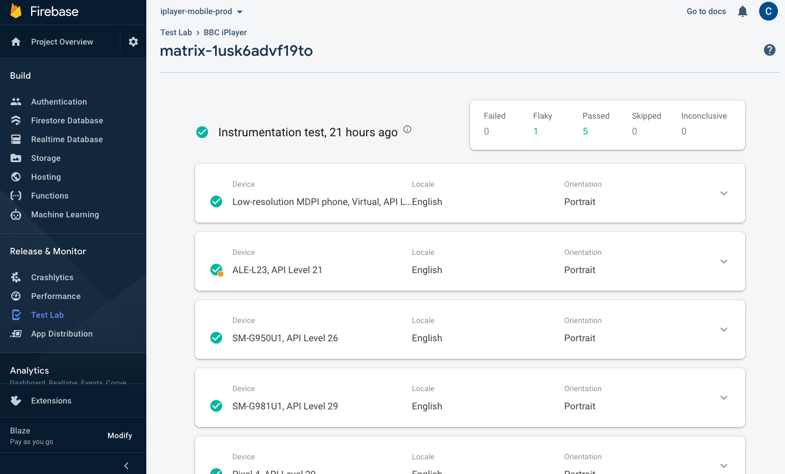
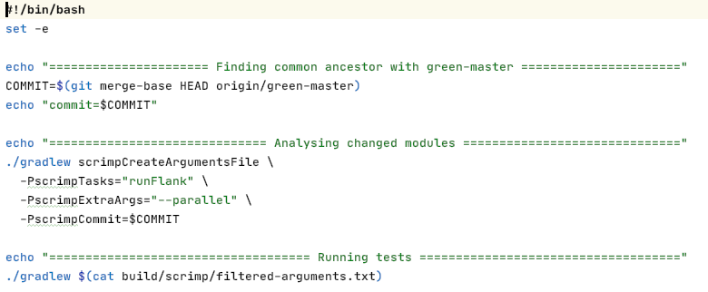

---

theme: "Moon"
transition: "fade"
defaultTiming: "20"

---

## Taming Android on-device testing

<aside class="notes">

* Who I am.
* Why we test on devices
  * We can't isolate everything from the OS.
  * E2E tests, integration tests, UI tests
  * OS version differences
  * Device/manufacturer differences
* Challenges
  * Slow
  * Flaky
</aside>

---

## In this talk

 1. Android Test Orchestrator
 2. Firebase test lab
 3. Fladle
 4. Scrimp
 5. Test failure tracking

<aside class="notes">
Android-focused, but some of the ideas and approaches can apply to different platforms.
</aside>

---

# Android Test Orchestrator

---

## Without Android Test Orchestrator

<aside class="notes">
Test Orchestrator fixes a long-standing issue on Android.

* Running tests creates the JUnitRunner process.
* One process to run all the tests - application process instance is shared between tests.
* Tests aren't guaranteed to be isolated: background processes, in memory, storage.
</aside>

---

## Android Test Orchestrator

---

## Android Test Orchestrator

<aside class="notes">

* Running tests creates the Test Orchestrator process.
* Test Orchestrator creates a JUnitRunner process for each test.
* Can also clear storage between tests, shown on the next slide.
</aside>

---

## Android Test Orchestrator

<aside class="notes">
Always use "clearPackageData"!
</aside>

---

# Firebase Test Lab

---

## Firebase Test Lab

<aside class="notes">
Like the Hive, but more mature & bigger scale.

AWS Device Farm not as fully-featured, and is far less popular.
</aside>

---

## Firebase Test Lab

<aside class="notes">
Mix of real devices & simulators.
</aside>

---

## Firebase Test Lab

<aside class="notes">
Richer features - videos, performance, easily see which tests failed, device configuration (language, orientation).
</aside>

---

## Firebase Test Lab

<aside class="notes">
Using standard tooling means we get to make use of open source tools.

Leading on to...
</aside>

---

# Fladle

---

## Fladle

<aside class="notes">
Like a power-up for Firebase Test Lab.

A wrapper for Flank, but easier to use for Android projects.
</aside>

---

## Fladle

---

## Fladle

---

## Fladle

---

## Fladle

---

## Fladle

<aside class="notes">
Sharding involves splitting running tests in groups. The groups can then be run in parallel.

Our test time no longer increases as we add more tests.

If tests fail, there are fewer to retry.
</aside>

---

## Fladle

---

## Fladle

---

## Fladle

---

## Fladle

---

# Scrimp

---

## Scrimp

<aside class="notes">
I wrote it. Got the idea from a Google talk, but Google never released a library.
</aside>

---

## Scrimp

<aside class="notes">
iPlayer project is a monorepo, with roughly 140 subprojects (and counting).

This shows a subset of our subprojects

The standard approach with CI is to run all the tests every time, but we can be smarter.
</aside>

---

## Scrimp

---

## Scrimp

<aside class="notes">
Note: we are going to change "master" to "main".

When master goes green, we push to a "green-master" branch.

For a PR, check what has changed since the "green-master" branch and only test those subprojects.

Need to run Gradle twice - one pass to work out which tasks to run, and one to actually run that subset of tasks. This _may_ change in future.
</aside>

---

# Test failure tracking

---

## Test failure tracking

<aside class="notes">
Worked on by Alex Savill and Matt Williams.

Red squiggles were just my IDE having a wobble. :)
</aside>

---

## Test failure tracking

<aside class="notes">
The important bit is the "RunWith" at the top. We have a handful of these runners for different types of test.
</aside>

---

## Test failure tracking

<aside class="notes">
The lint checks ensure we never forget to use one of our reporting test runners.
</aside>

---

## Test failure tracking

<aside class="notes">
The payoff!

Very much a work in process, but already valuable and Alex is continuing to improve it.
</aside>

---

# Questions?
